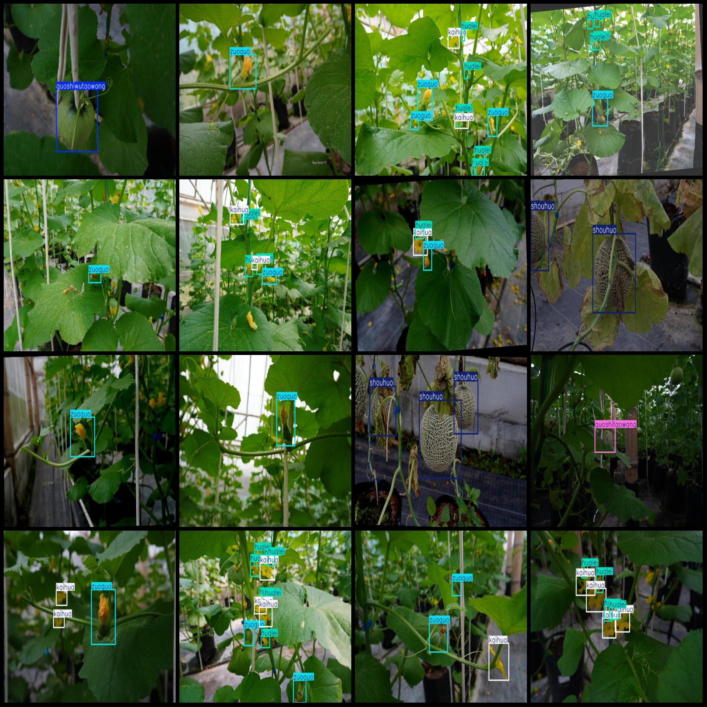
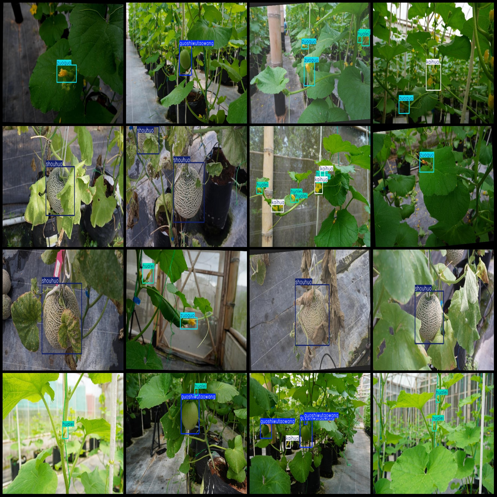

# Wine grape maturity detection dataset VOC+YOLO format with 339 images in 6 categories

Dataset format: Pascal VOC format + YOLO format (txt files without split path, only containing jpg images and corresponding VOC format xml files and YOLO format txt files)
Number of images (total): 3239
Number of labels (total): 3239
Number of labels (total): 3239
Number of categories: 6
Label names in YOLO format (do not match this order with the labels folder classes.txt): ["guoshitaowang", "guoshiwutaowang", "hualei", "kaihua", "shouhuo", "zuoguo"]
["fruit netting", "fruit without netting", "bud", "bloom", "harvest", "fruit set"]
Box counts for each category:
- guoshitaowang box count = 756
- guoshiwutaowang box count = 739
- hualei box count = 2299
- kaihua box count = 1379
- shouhuo box count = 1174
- zuoguo box count = 1006
Total box count: 7353
Number of images in each category:
The number of pictures owned by Guoshi Taowang is 408.
"Gushi Wutao Wang" is a Chinese name, which translates to "Gushi Woutao Wang" or "Gu Shi Woutao Wang." However, the term "gushishouyin" does not have a direct translation in English. It seems like you may be referring to someone who owns or has access to a large number of images. If that's the case, it would depend on the context and the specific meaning behind the phrase.
Hualei's possession of pictures = 1059.
Kaihua owns 851 images.
The number of photos owned by shouhuo = 838.
Zuoguo's possession of images = 857
Image resolution: 640x427
Annotation Tool: labelImg
Annotation Rules: Draw a rectangle around the class.
Important Notes: The dataset does not have separate training, validation, and test sets, so they need to be manually divided.
Special Statement: This dataset does not guarantee the accuracy of the trained model or weight files.
Image Preview:
## Images

Here is a pay link on Stripe ( https://buy.stripe.com/3cs8yP7sY87d0vu9AB ). Please contact me lonlonago@foxmail.com after funding $89, and I will send you a complete data files , thank you!

